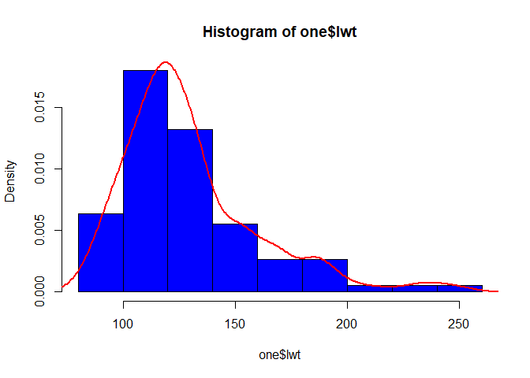

Untitled
================

``` r
if (!require('readxl')) install.packages('readxl') 
```

    ## Loading required package: readxl

``` r
if (!require('broom')) install.packages('broom') 
```

    ## Loading required package: broom

``` r
if (!require('epitools')) install.packages('epitools') 
```

    ## Loading required package: epitools

``` r
if (!require('car')) install.packages('car') 
```

    ## Loading required package: car

    ## Loading required package: carData

``` r
library(readxl)
library(broom)
library(epitools)
library(car)
```

``` r
# read in data ------------------------------------------------------------

zero <- read.table("data/LBWEIGHT.txt", 
                   header = F, 
                   col.names = c("idnum", "low", "age", "lwt", "race", "ftv"))

one <- zero
```

``` r
# descriptive and logistic regression -------------------------------------

#frequency and relative frequency of low birth weight
table(one$low, dnn = "low birth weight")
```

    ## low birth weight
    ##   0   1 
    ## 130  59

``` r
prop.table(table(one$low, dnn = "low birth weight"))
```

    ## low birth weight
    ##         0         1 
    ## 0.6878307 0.3121693

``` r
summary(one$lwt)
```

    ##    Min. 1st Qu.  Median    Mean 3rd Qu.    Max. 
    ##    80.0   110.0   121.0   129.8   140.0   250.0

``` r
c(mean = mean(one$lwt), sd = sd(one$lwt))
```

    ##      mean        sd 
    ## 129.81481  30.57938

``` r
#distribution of weight at last period
hist(one$lwt, probability =  T, col = "blue")
lines(density(one$lwt), col = "red", lwd = 2)
```

<!-- -->

``` r
#logistic regression model of low birth weight with weight at last period as predictor
logreg1 <- glm(low ~ lwt, family = binomial(), data = one)
tidy(logreg1)
```

    ## # A tibble: 2 x 5
    ##   term        estimate std.error statistic p.value
    ##   <chr>          <dbl>     <dbl>     <dbl>   <dbl>
    ## 1 (Intercept)   0.998    0.785        1.27  0.204 
    ## 2 lwt          -0.0141   0.00617     -2.28  0.0227

``` r
#odds ratio and 95% CI
tidy(logreg1, conf.int = T, exp = T)[2,]
```

    ## # A tibble: 1 x 7
    ##   term  estimate std.error statistic p.value conf.low conf.high
    ##   <chr>    <dbl>     <dbl>     <dbl>   <dbl>    <dbl>     <dbl>
    ## 1 lwt      0.986   0.00617     -2.28  0.0227    0.973     0.997

``` r
#odds ratio and 95% CI with SD units
exp(sd(one$lwt)* c(tidy(logreg1, conf.int = T)$estimate[2], 
      tidy(logreg1, conf.int = T)$conf.low[2],
      tidy(logreg1, conf.int = T)$conf.high[2]))
```

    ## [1] 0.6505788 0.4384626 0.9221601

``` r
one$race2 <- ifelse(one$race > 1, 1, 0)
```

``` r
# categorical predictors --------------------------------------------------

#rename race categories and convert to factor
one$race <- ifelse(one$race == 1, "white",
                   ifelse(one$race == 2, "black",
                          ifelse(one$race == 3, "other", NA)))
one$race <- factor(one$race, levels = c("white", "black", "other"))
```

``` r
#frequency tables
table(one$race)
```

    ## 
    ## white black other 
    ##    96    26    67

``` r
table(one$race, one$low)
```

    ##        
    ##          0  1
    ##   white 73 23
    ##   black 15 11
    ##   other 42 25

``` r
prop.table(table(one$race, one$low))
```

    ##        
    ##                  0          1
    ##   white 0.38624339 0.12169312
    ##   black 0.07936508 0.05820106
    ##   other 0.22222222 0.13227513

``` r
chisq.test(table(one$race, one$low))
```

    ## 
    ##  Pearson's Chi-squared test
    ## 
    ## data:  table(one$race, one$low)
    ## X-squared = 5.0048, df = 2, p-value = 0.08189

``` r
oddsratio(table(one$race, one$low))
```

    ## $data
    ##        
    ##           0  1 Total
    ##   white  73 23    96
    ##   black  15 11    26
    ##   other  42 25    67
    ##   Total 130 59   189
    ## 
    ## $measure
    ##        odds ratio with 95% C.I.
    ##         estimate     lower    upper
    ##   white 1.000000        NA       NA
    ##   black 2.313376 0.9104787 5.791019
    ##   other 1.879965 0.9481396 3.754299
    ## 
    ## $p.value
    ##        two-sided
    ##         midp.exact fisher.exact chi.square
    ##   white         NA           NA         NA
    ##   black 0.07724873   0.08433263 0.06414755
    ##   other 0.07064562   0.08111446 0.06568953
    ## 
    ## $correction
    ## [1] FALSE
    ## 
    ## attr(,"method")
    ## [1] "median-unbiased estimate & mid-p exact CI"

``` r
#logistic regression model with a categorical predictors
logreg2 <- glm(low ~ as.numeric(race), data = one, family = binomial() )
tidy(logreg2)
```

    ## # A tibble: 2 x 5
    ##   term             estimate std.error statistic  p.value
    ##   <chr>               <dbl>     <dbl>     <dbl>    <dbl>
    ## 1 (Intercept)        -1.40      0.369     -3.80 0.000145
    ## 2 as.numeric(race)    0.323     0.171      1.88 0.0596

``` r
logreg3 <- glm(low ~ race, data = one, family = binomial() )
tidy(logreg3)
```

    ## # A tibble: 3 x 5
    ##   term        estimate std.error statistic    p.value
    ##   <chr>          <dbl>     <dbl>     <dbl>      <dbl>
    ## 1 (Intercept)   -1.15      0.239     -4.83 0.00000136
    ## 2 raceblack      0.845     0.463      1.82 0.0683    
    ## 3 raceother      0.636     0.348      1.83 0.0674

``` r
tidy(logreg3, conf.int = T, exp = T)[2:3,]
```

    ## # A tibble: 2 x 7
    ##   term      estimate std.error statistic p.value conf.low conf.high
    ##   <chr>        <dbl>     <dbl>     <dbl>   <dbl>    <dbl>     <dbl>
    ## 1 raceblack     2.33     0.463      1.82  0.0683    0.926      5.77
    ## 2 raceother     1.89     0.348      1.83  0.0674    0.957      3.76

``` r
glance(logreg3)
```

    ## # A tibble: 1 x 8
    ##   null.deviance df.null logLik   AIC   BIC deviance df.residual  nobs
    ##           <dbl>   <int>  <dbl> <dbl> <dbl>    <dbl>       <int> <int>
    ## 1          235.     188  -115.  236.  245.     230.         186   189

``` r
#type 3 tests
Anova(logreg3, type = "III", test.statistic = "Wald")
```

    ## Analysis of Deviance Table (Type III tests)
    ## 
    ## Response: low
    ##             Df   Chisq Pr(>Chisq)    
    ## (Intercept)  1 23.3302  1.364e-06 ***
    ## race         2  4.9224    0.08533 .  
    ## ---
    ## Signif. codes:  0 '***' 0.001 '**' 0.01 '*' 0.05 '.' 0.1 ' ' 1

``` r
# logistic regression with multiple predictors ----------------------------

logreg4 <- glm(low ~ age + lwt + race2 + ftv + race2*lwt, family = binomial(), data = one)
tidy(logreg4)
```

    ## # A tibble: 6 x 5
    ##   term        estimate std.error statistic p.value
    ##   <chr>          <dbl>     <dbl>     <dbl>   <dbl>
    ## 1 (Intercept)  1.40      1.43       0.982    0.326
    ## 2 age         -0.0279    0.0336    -0.829    0.407
    ## 3 lwt         -0.0144    0.00982   -1.46     0.143
    ## 4 race2        0.104     1.61       0.0646   0.948
    ## 5 ftv         -0.0427    0.166     -0.258    0.797
    ## 6 lwt:race2    0.00386   0.0126     0.307    0.759

``` r
tidy(logreg4, conf.int = T, exp = T)
```

    ## # A tibble: 6 x 7
    ##   term        estimate std.error statistic p.value conf.low conf.high
    ##   <chr>          <dbl>     <dbl>     <dbl>   <dbl>    <dbl>     <dbl>
    ## 1 (Intercept)    4.06    1.43       0.982    0.326   0.272      76.8 
    ## 2 age            0.972   0.0336    -0.829    0.407   0.909       1.04
    ## 3 lwt            0.986   0.00982   -1.46     0.143   0.965       1.00
    ## 4 race2          1.11    1.61       0.0646   0.948   0.0446     25.8 
    ## 5 ftv            0.958   0.166     -0.258    0.797   0.684       1.32
    ## 6 lwt:race2      1.00    0.0126     0.307    0.759   0.980       1.03
