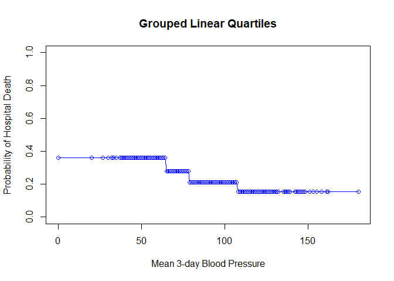
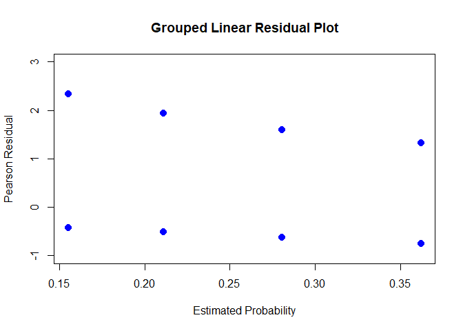
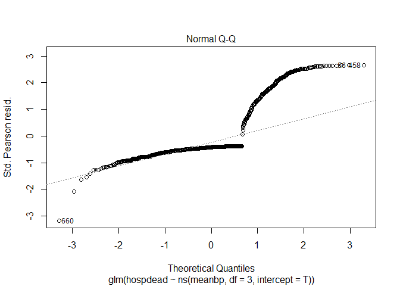

Lecture 3: Non-linear predictors and model fit
================

``` r
# install/load packages ---------------------------------------------------
if (!require('readxl')) install.packages('readxl') 
```

    ## Loading required package: readxl

``` r
if (!require('broom')) install.packages('broom') 
```

    ## Loading required package: broom

``` r
if (!require('epitools')) install.packages('epitools') 
```

    ## Loading required package: epitools

``` r
if (!require('car')) install.packages('car') 
```

    ## Loading required package: car

    ## Loading required package: carData

``` r
if (!require('splines')) install.packages('splines') 
```

    ## Loading required package: splines

``` r
if (!require('rms')) install.packages('rms') 
```

    ## Loading required package: rms

    ## Loading required package: Hmisc

    ## Loading required package: lattice

    ## Loading required package: survival

    ## 
    ## Attaching package: 'survival'

    ## The following object is masked from 'package:epitools':
    ## 
    ##     ratetable

    ## Loading required package: Formula

    ## Loading required package: ggplot2

    ## 
    ## Attaching package: 'Hmisc'

    ## The following objects are masked from 'package:base':
    ## 
    ##     format.pval, units

    ## Loading required package: SparseM

    ## 
    ## Attaching package: 'SparseM'

    ## The following object is masked from 'package:base':
    ## 
    ##     backsolve

    ## 
    ## Attaching package: 'rms'

    ## The following objects are masked from 'package:car':
    ## 
    ##     Predict, vif

``` r
if (!require('ResourceSelection')) install.packages('ResourceSelection') 
```

    ## Loading required package: ResourceSelection

    ## ResourceSelection 0.3-5   2019-07-22

``` r
library(readxl)
library(broom)
library(epitools)
library(car)
library(splines)
library(rms)
library(ResourceSelection)
```

``` r
# read in data ------------------------------------------------------------

zero <- read_excel("data/support.xlsx")

one <- as.data.frame(zero)
```

``` r
# linear fit --------------------------------------------------------------

logreg0 <- glm(hospdead ~ meanbp, data = one, family = binomial())

plot(one$meanbp, one$hospdead, 
     col = "red",
     pch = 19,
     xlab = "Mean BP",
     ylab = "Hospital Death",
     main = "Predicted values by Blood Pressure")
points(one$meanbp, logreg0$fitted.values, pch = 19, col = "blue")
lines(one$meanbp[order(one$meanbp)], logreg0$fitted.values[order(one$meanbp)], col = "blue")
```

<!-- -->

``` r
plot(one$meanbp, residuals(logreg0, type = "pearson"), 
     col = "red",
     pch = 19,
     xlab = "Predicted values by Blood Pressure",
     ylab = "Pearson Residual",
     main = "Residuals by Blood Pressure")
abline(h = 3)
```

<!-- -->

``` r
# loess fit ---------------------------------------------------------------

#fit loess model
loessmod <- loess(hospdead ~ meanbp, data = one, span = 0.265)

#plot the raw outcome against meanbp with a loess fit
o <- order(one$meanbp)

plot(one$meanbp, one$hospdead, 
     col = "red",
     main = "Hospital Death by Blood Pressure",
     xlab = "Mean 3-day Blood Pressure",
     ylab = "Hospital Vital Status")
lines(one$meanbp[o], loessmod$fitted[o])
```

<!-- -->

``` r
# model with BP quartiles -------------------------------------------------

#create a 4 level variable for mean bp
one$bpqrt <- ifelse(one$meanbp <= 64, 1,
                    ifelse(one$meanbp > 64 & one$meanbp  <= 78, 2,
                           ifelse(one$meanbp > 78 & one$meanbp <= 107, 3,
                                  ifelse(one$meanbp > 107, 4, NA))))
one$bpqrt <- factor(one$bpqrt, levels = c(2, 1, 3, 4))

logreg1 <- glm(hospdead ~ bpqrt, data = one, family = binomial())

tidy(logreg1)
```

    ## # A tibble: 4 x 5
    ##   term        estimate std.error statistic  p.value
    ##   <chr>          <dbl>     <dbl>     <dbl>    <dbl>
    ## 1 (Intercept)   -1.60      0.167     -9.54 1.44e-21
    ## 2 bpqrt1         1.45      0.210      6.91 4.72e-12
    ## 3 bpqrt3        -0.267     0.249     -1.07 2.83e- 1
    ## 4 bpqrt4         0.486     0.224      2.17 3.01e- 2

``` r
tidy(logreg1, conf.int = T, exp = T)
```

    ## # A tibble: 4 x 7
    ##   term        estimate std.error statistic  p.value conf.low conf.high
    ##   <chr>          <dbl>     <dbl>     <dbl>    <dbl>    <dbl>     <dbl>
    ## 1 (Intercept)    0.203     0.167     -9.54 1.44e-21    0.144     0.278
    ## 2 bpqrt1         4.27      0.210      6.91 4.72e-12    2.85      6.49 
    ## 3 bpqrt3         0.765     0.249     -1.07 2.83e- 1    0.468     1.24 
    ## 4 bpqrt4         1.63      0.224      2.17 3.01e- 2    1.05      2.53

``` r
glance(logreg1)
```

    ## # A tibble: 1 x 8
    ##   null.deviance df.null logLik   AIC   BIC deviance df.residual  nobs
    ##           <dbl>   <int>  <dbl> <dbl> <dbl>    <dbl>       <int> <int>
    ## 1         1131.     999  -524. 1055. 1075.    1047.         996  1000

``` r
Anova(logreg1)
```

    ## Analysis of Deviance Table (Type II tests)
    ## 
    ## Response: hospdead
    ##       LR Chisq Df Pr(>Chisq)    
    ## bpqrt   83.794  3  < 2.2e-16 ***
    ## ---
    ## Signif. codes:  0 '***' 0.001 '**' 0.01 '*' 0.05 '.' 0.1 ' ' 1

``` r
plot(one$meanbp, logreg1$fitted.values, 
     col = "red",
     ylab = "Probability of Hospital Death",
     xlab = "Mean 3-day Blood Pressure",
     main = "Dummy Variable Quartiles",
     ylim = c(0,1))
lines(one$meanbp[o], logreg1$fitted.values[o], col = "red")
```

<!-- -->

``` r
plot(logreg1$fitted.values, residuals(logreg1, type = "pearson"), 
     col = "red",
     ylab = "Pearson Residual",
     xlab = "Estimated Probability",
     main = "Dummy Variable Residual Plot", 
     pch = 20,
     ylim = c(-1, 3),
     cex = 2)
```

<!-- -->

``` r
# fit grouped linear quartiles trend ------------------------------------------------

levels(one$bpqrt)
```

    ## [1] "2" "1" "3" "4"

``` r
one$bpqrt_num <- as.numeric(relevel(one$bpqrt, ref = "1"))


logreg2 <- glm(hospdead ~ bpqrt_num, data = one, family = binomial())

tidy(logreg2)
```

    ## # A tibble: 2 x 5
    ##   term        estimate std.error statistic      p.value
    ##   <chr>          <dbl>     <dbl>     <dbl>        <dbl>
    ## 1 (Intercept)   -0.190    0.171      -1.11 0.267       
    ## 2 bpqrt_num     -0.376    0.0683     -5.50 0.0000000370

``` r
tidy(logreg2, conf.int = T, exp = T)
```

    ## # A tibble: 2 x 7
    ##   term        estimate std.error statistic      p.value conf.low conf.high
    ##   <chr>          <dbl>     <dbl>     <dbl>        <dbl>    <dbl>     <dbl>
    ## 1 (Intercept)    0.827    0.171      -1.11 0.267           0.590     1.16 
    ## 2 bpqrt_num      0.687    0.0683     -5.50 0.0000000370    0.600     0.784

``` r
glance(logreg2)
```

    ## # A tibble: 1 x 8
    ##   null.deviance df.null logLik   AIC   BIC deviance df.residual  nobs
    ##           <dbl>   <int>  <dbl> <dbl> <dbl>    <dbl>       <int> <int>
    ## 1         1131.     999  -550. 1104. 1113.    1100.         998  1000

``` r
Anova(logreg2)
```

    ## Analysis of Deviance Table (Type II tests)
    ## 
    ## Response: hospdead
    ##           LR Chisq Df Pr(>Chisq)    
    ## bpqrt_num   31.591  1  1.903e-08 ***
    ## ---
    ## Signif. codes:  0 '***' 0.001 '**' 0.01 '*' 0.05 '.' 0.1 ' ' 1

``` r
plot(one$meanbp, logreg2$fitted.values, 
     col = "blue",
     ylab = "Probability of Hospital Death",
     xlab = "Mean 3-day Blood Pressure",
     main = "Grouped Linear Quartiles",
     ylim = c(0,1))
lines(one$meanbp[o], logreg2$fitted.values[o], col = "blue")
```

<!-- -->

``` r
plot(logreg2$fitted.values, residuals(logreg2, type = "pearson"), 
     col = "blue",
     ylab = "Pearson Residual",
     xlab = "Estimated Probability",
     main = "Grouped Linear Residual Plot", 
     pch = 20,
     ylim = c(-1, 3),
     cex = 2)
```

<!-- -->

``` r
# fit with quadratic term -------------------------------------------------

logreg3 <- glm(hospdead ~ meanbp + I(meanbp^2), data = one, family = binomial())

tidy(logreg3)
```

    ## # A tibble: 3 x 5
    ##   term         estimate std.error statistic  p.value
    ##   <chr>           <dbl>     <dbl>     <dbl>    <dbl>
    ## 1 (Intercept)  5.89     0.746          7.90 2.82e-15
    ## 2 meanbp      -0.158    0.0177        -8.94 4.06e-19
    ## 3 I(meanbp^2)  0.000802 0.0000967      8.29 1.18e-16

``` r
tidy(logreg3, conf.int = T, exp = T)
```

    ## # A tibble: 3 x 7
    ##   term        estimate std.error statistic  p.value conf.low conf.high
    ##   <chr>          <dbl>     <dbl>     <dbl>    <dbl>    <dbl>     <dbl>
    ## 1 (Intercept)  363.    0.746          7.90 2.82e-15   87.0    1624.   
    ## 2 meanbp         0.854 0.0177        -8.94 4.06e-19    0.824     0.883
    ## 3 I(meanbp^2)    1.00  0.0000967      8.29 1.18e-16    1.00      1.00

``` r
glance(logreg3)
```

    ## # A tibble: 1 x 8
    ##   null.deviance df.null logLik   AIC   BIC deviance df.residual  nobs
    ##           <dbl>   <int>  <dbl> <dbl> <dbl>    <dbl>       <int> <int>
    ## 1         1131.     999  -507. 1019. 1034.    1013.         997  1000

``` r
Anova(logreg3)
```

    ## Analysis of Deviance Table (Type II tests)
    ## 
    ## Response: hospdead
    ##             LR Chisq Df Pr(>Chisq)    
    ## meanbp       100.353  1  < 2.2e-16 ***
    ## I(meanbp^2)   81.752  1  < 2.2e-16 ***
    ## ---
    ## Signif. codes:  0 '***' 0.001 '**' 0.01 '*' 0.05 '.' 0.1 ' ' 1

``` r
plot(one$meanbp, logreg3$fitted.values, 
     col = "darkgreen",
     ylab = "Probability of Hospital Death",
     xlab = "Mean 3-day Blood Pressure",
     main = "Quadratic Model",
     ylim = c(0,1))
lines(one$meanbp[o], logreg3$fitted.values[o], col = "darkgreen")
```

<!-- -->

``` r
plot(logreg3$fitted.values, residuals(logreg3, type = "pearson"), 
     col = "red",
     ylab = "Pearson Residual",
     xlab = "Estimated Probability",
     main = "Quadratic Model Residual Plot", 
     pch = 20,
     ylim = c(-6, 3),
     cex = 2)
```

<!-- -->

``` r
# fit with natural cubic splines ------------------------------------------

logreg4 <- glm(hospdead ~ ns(meanbp, df = 3, intercept = T), data = one, family = binomial())

tidy(logreg4)
```

    ## # A tibble: 4 x 5
    ##   term                               estimate std.error statistic       p.value
    ##   <chr>                                 <dbl>     <dbl>     <dbl>         <dbl>
    ## 1 (Intercept)                           -1.04      1.85    -0.563  0.573       
    ## 2 ns(meanbp, df = 3, intercept = T)1    -6.58      1.22    -5.39   0.0000000714
    ## 3 ns(meanbp, df = 3, intercept = T)2     5.98      3.80     1.58   0.115       
    ## 4 ns(meanbp, df = 3, intercept = T)3    NA        NA       NA     NA

``` r
glance(logreg4)
```

    ## # A tibble: 1 x 8
    ##   null.deviance df.null logLik   AIC   BIC deviance df.residual  nobs
    ##           <dbl>   <int>  <dbl> <dbl> <dbl>    <dbl>       <int> <int>
    ## 1         1131.     999  -504. 1013. 1028.    1007.         997  1000

``` r
Anova(logreg4)
```

    ## Analysis of Deviance Table (Type II tests)
    ## 
    ## Response: hospdead
    ##                                   LR Chisq Df Pr(>Chisq)    
    ## ns(meanbp, df = 3, intercept = T)   123.72  2  < 2.2e-16 ***
    ## ---
    ## Signif. codes:  0 '***' 0.001 '**' 0.01 '*' 0.05 '.' 0.1 ' ' 1

``` r
plot(one$meanbp, logreg4$fitted.values, 
     col = "darkgreen",
     ylab = "Probability of Hospital Death",
     xlab = "Mean 3-day Blood Pressure",
     main = "Continuous Spline Predicted against BP",
     ylim = c(0,1))
lines(one$meanbp[o], logreg4$fitted.values[o], col = "darkgreen")
```

<!-- -->

``` r
plot(logreg4$fitted.values, residuals(logreg4, type = "pearson"), 
     col = "red",
     ylab = "Pearson Residual",
     xlab = "Estimated Probability",
     main = "Grouped Linear Residual Plot", 
     pch = 20,
     ylim = c(-6, 3),
     cex =2)
```

<!-- -->

``` r
# Assessing Model Fit -----------------------------------------------------

rms::lrm(hospdead ~ bpqrt, data = one)
```

    ## Logistic Regression Model
    ##  
    ##  rms::lrm(formula = hospdead ~ bpqrt, data = one)
    ##  
    ##                         Model Likelihood    Discrimination    Rank Discrim.    
    ##                               Ratio Test           Indexes          Indexes    
    ##  Obs          1000    LR chi2      83.79    R2       0.119    C       0.677    
    ##   0            747    d.f.             3    g        0.707    Dxy     0.353    
    ##   1            253    Pr(> chi2) <0.0001    gr       2.027    gamma   0.458    
    ##  max |deriv| 6e-09                          gp       0.134    tau-a   0.134    
    ##                                             Brier    0.172                     
    ##  
    ##            Coef    S.E.   Wald Z Pr(>|Z|)
    ##  Intercept -1.5954 0.1673 -9.54  <0.0001 
    ##  bpqrt=1    1.4511 0.2099  6.91  <0.0001 
    ##  bpqrt=3   -0.2673 0.2489 -1.07  0.2828  
    ##  bpqrt=4    0.4857 0.2239  2.17  0.0301  
    ## 

``` r
#Hosmer-Lemeshow test
ResourceSelection::hoslem.test(logreg1$y, fitted(logreg1))
```

    ## 
    ##  Hosmer and Lemeshow goodness of fit (GOF) test
    ## 
    ## data:  logreg1$y, fitted(logreg1)
    ## X-squared = 4.3517e-22, df = 8, p-value = 1

``` r
# Assessing Model Fit -----------------------------------------------------

plot(logreg4)
```

<!-- --><!-- --><!-- --><!-- -->

``` r
save <- rms::lrm(hospdead ~ bpqrt, data = one, y = T, x = T)

o2 <- order(logreg4$fitted.values)

plot(logreg4$fitted.values[o2], residuals(logreg4, type = "deviance")[o2], 
     col = "darkgreen",
     ylab = "Pearson Residual",
     xlab = "Estimated Probability",
     main = "Continuous BP with Spline", 
     pch = 20,
     ylim = c(-6, 3))
```

<!-- -->
