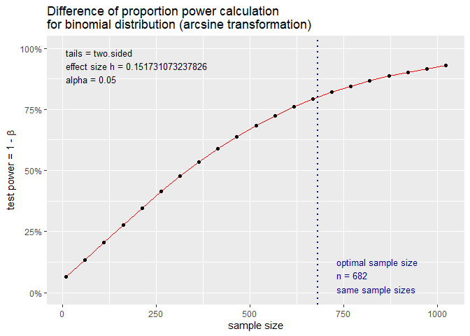

Numerical problems & variable selection
================

``` r
# install/load packages ---------------------------------------------------
if (!require('readxl')) install.packages('readxl') 
```

    ## Loading required package: readxl

``` r
if (!require('broom')) install.packages('broom') 
```

    ## Loading required package: broom

``` r
if (!require('epitools')) install.packages('epitools') 
```

    ## Loading required package: epitools

``` r
if (!require('logistf')) install.packages('logistf') 
```

    ## Loading required package: logistf

``` r
if (!require('pwr')) install.packages('pwr') 
```

    ## Loading required package: pwr

``` r
if (!require('survival')) install.packages('survival')
```

    ## Loading required package: survival

    ## 
    ## Attaching package: 'survival'

    ## The following object is masked from 'package:epitools':
    ## 
    ##     ratetable

``` r
library(readxl)
library(broom)
library(epitools)
library(logistf)
library(pwr)
library(survival)
```

``` r
# read in data ------------------------------------------------------------

zero <- read_excel("data/ICU.xlsx")

one <- as.data.frame(zero)

names(one) <- tolower(names(one))

one$loc <- factor(one$loc)
one$sex <- factor(one$sex)
one$race <- factor(one$race)
one$ser <- factor(one$ser)
one$can <- factor(one$can)
one$crn <- factor(one$crn)
one$cpr <- factor(one$cpr)
one$inf <- factor(one$inf)
one$pre <- factor(one$pre)
one$typ <- factor(one$typ)
one$fra <- factor(one$fra)
one$po2 <- factor(one$po2)
one$ph <- factor(one$ph)
one$pco <- factor(one$pco)
one$bic <- factor(one$bic)
one$cre <- factor(one$cre)
one$loc <- factor(one$loc)
```

``` r
# Numerical problems in logistic regression -------------------------------

table(one$loc, one$sta)
```

    ##    
    ##       0   1
    ##   1 158  27
    ##   2   0   5
    ##   3   2   8

``` r
logreg1 <- glm(sta ~ loc, family = binomial(), data = one)
tidy(logreg1)
```

    ## # A tibble: 3 x 5
    ##   term        estimate std.error statistic  p.value
    ##   <chr>          <dbl>     <dbl>     <dbl>    <dbl>
    ## 1 (Intercept)    -1.77     0.208   -8.48   2.18e-17
    ## 2 loc2           18.3   1073.       0.0171 9.86e- 1
    ## 3 loc3            3.15     0.818    3.86   1.15e- 4

``` r
tidy(logreg1, exp = T, conf.int = T)
```

    ## Warning: glm.fit: fitted probabilities numerically 0 or 1 occurred
    
    ## Warning: glm.fit: fitted probabilities numerically 0 or 1 occurred
    
    ## Warning: glm.fit: fitted probabilities numerically 0 or 1 occurred
    
    ## Warning: glm.fit: fitted probabilities numerically 0 or 1 occurred
    
    ## Warning: glm.fit: fitted probabilities numerically 0 or 1 occurred
    
    ## Warning: glm.fit: fitted probabilities numerically 0 or 1 occurred
    
    ## Warning: glm.fit: fitted probabilities numerically 0 or 1 occurred
    
    ## Warning: glm.fit: fitted probabilities numerically 0 or 1 occurred
    
    ## Warning: glm.fit: fitted probabilities numerically 0 or 1 occurred
    
    ## Warning: glm.fit: fitted probabilities numerically 0 or 1 occurred
    
    ## Warning: glm.fit: fitted probabilities numerically 0 or 1 occurred
    
    ## Warning: glm.fit: fitted probabilities numerically 0 or 1 occurred
    
    ## Warning: glm.fit: fitted probabilities numerically 0 or 1 occurred
    
    ## Warning: glm.fit: fitted probabilities numerically 0 or 1 occurred

    ## # A tibble: 3 x 7
    ##   term            estimate std.error statistic  p.value conf.low conf.high
    ##   <chr>              <dbl>     <dbl>     <dbl>    <dbl>    <dbl>     <dbl>
    ## 1 (Intercept)        0.171     0.208   -8.48   2.18e-17 1.11e- 1     0.252
    ## 2 loc2        91589445.     1073.       0.0171 9.86e- 1 4.00e-41    NA    
    ## 3 loc3              23.4       0.818    3.86   1.15e- 4 5.52e+ 0   161.

``` r
logreg2 <- logistf(sta ~ loc, data = one)
summary(logreg2)
```

    ## logistf(formula = sta ~ loc, data = one)
    ## 
    ## Model fitted by Penalized ML
    ## Coefficients:
    ##                  coef  se(coef) lower 0.95 upper 0.95    Chisq            p
    ## (Intercept) -1.751569 0.2071315  -2.177375  -1.364394      Inf 0.000000e+00
    ## loc2         4.149465 1.6312838   1.928464   9.037377 16.90183 3.936363e-05
    ## loc3         2.975344 0.7825057   1.625498   4.681173 19.71226 9.002216e-06
    ##             method
    ## (Intercept)      2
    ## loc2             2
    ## loc3             2
    ## 
    ## Method: 1-Wald, 2-Profile penalized log-likelihood, 3-None
    ## 
    ## Likelihood ratio test=34.54744 on 2 df, p=3.148615e-08, n=200
    ## Wald test = 20.30079 on 2 df, p = 3.906063e-05

``` r
cbind(OR = exp(logreg2$coefficients), 
      lower = exp(logreg2$ci.lower), 
      upper = exp(logreg2$ci.upper))
```

    ##                     OR     lower        upper
    ## (Intercept)  0.1735016 0.1133386    0.2555354
    ## loc2        63.4000502 6.8789331 8411.6827261
    ## loc3        19.5963637 5.0809500  107.8965792

``` r
fisher.test(table(one$loc, one$sta))
```

    ## 
    ##  Fisher's Exact Test for Count Data
    ## 
    ## data:  table(one$loc, one$sta)
    ## p-value = 5.737e-09
    ## alternative hypothesis: two.sided

``` r
logreg3 <- glm(sta ~ loc, family = binomial(), data = one)
```

``` r
# selection methods -------------------------------------------------------

full <- glm(sta ~ sex + age + race + ser + can +
              crn + inf + cpr + pre + typ + fra + po2 +
              ph + pco + bic + cre, 
            family = binomial(), data = one)

fwd <- step(full, direction =  "forward")
```

    ## Start:  AIC=192.53
    ## sta ~ sex + age + race + ser + can + crn + inf + cpr + pre + 
    ##     typ + fra + po2 + ph + pco + bic + cre

``` r
fwd2 <- step(full, direction = "forward", steps = 2)
```

    ## Start:  AIC=192.53
    ## sta ~ sex + age + race + ser + can + crn + inf + cpr + pre + 
    ##     typ + fra + po2 + ph + pco + bic + cre

``` r
bw <- step(full, direction =  "backward")
```

    ## Start:  AIC=192.53
    ## sta ~ sex + age + race + ser + can + crn + inf + cpr + pre + 
    ##     typ + fra + po2 + ph + pco + bic + cre
    ## 
    ##        Df Deviance    AIC
    ## - race  2   158.08 190.08
    ## - bic   1   156.54 190.54
    ## - ph    1   156.62 190.62
    ## - po2   1   156.66 190.66
    ## - ser   1   156.69 190.69
    ## - crn   1   156.77 190.77
    ## - inf   1   156.78 190.78
    ## - cre   1   156.79 190.79
    ## - fra   1   157.28 191.28
    ## - pco   1   157.55 191.55
    ## - pre   1   157.81 191.81
    ## - sex   1   157.96 191.96
    ## <none>      156.53 192.53
    ## - can   1   161.27 195.27
    ## - cpr   1   161.32 195.32
    ## - age   1   165.75 199.75
    ## - typ   1   168.61 202.61
    ## 
    ## Step:  AIC=190.08
    ## sta ~ sex + age + ser + can + crn + inf + cpr + pre + typ + fra + 
    ##     po2 + ph + pco + bic + cre
    ## 
    ##        Df Deviance    AIC
    ## - bic   1   158.08 188.08
    ## - ser   1   158.12 188.12
    ## - crn   1   158.20 188.20
    ## - ph    1   158.23 188.23
    ## - po2   1   158.29 188.29
    ## - cre   1   158.39 188.39
    ## - inf   1   158.42 188.42
    ## - fra   1   158.68 188.68
    ## - pre   1   159.05 189.05
    ## - pco   1   159.20 189.20
    ## - sex   1   159.46 189.46
    ## <none>      158.08 190.08
    ## - cpr   1   162.88 192.88
    ## - can   1   162.90 192.90
    ## - age   1   168.87 198.87
    ## - typ   1   170.73 200.73
    ## 
    ## Step:  AIC=188.08
    ## sta ~ sex + age + ser + can + crn + inf + cpr + pre + typ + fra + 
    ##     po2 + ph + pco + cre
    ## 
    ##        Df Deviance    AIC
    ## - ser   1   158.12 186.12
    ## - crn   1   158.21 186.21
    ## - ph    1   158.23 186.23
    ## - po2   1   158.29 186.29
    ## - cre   1   158.39 186.39
    ## - inf   1   158.42 186.42
    ## - fra   1   158.70 186.70
    ## - pre   1   159.09 187.09
    ## - pco   1   159.24 187.24
    ## - sex   1   159.47 187.47
    ## <none>      158.08 188.08
    ## - cpr   1   162.95 190.95
    ## - can   1   162.98 190.98
    ## - age   1   168.87 196.87
    ## - typ   1   170.76 198.76
    ## 
    ## Step:  AIC=186.12
    ## sta ~ sex + age + can + crn + inf + cpr + pre + typ + fra + po2 + 
    ##     ph + pco + cre
    ## 
    ##        Df Deviance    AIC
    ## - crn   1   158.25 184.25
    ## - ph    1   158.28 184.28
    ## - po2   1   158.37 184.37
    ## - cre   1   158.44 184.44
    ## - inf   1   158.47 184.47
    ## - fra   1   158.70 184.70
    ## - pre   1   159.10 185.10
    ## - pco   1   159.27 185.27
    ## - sex   1   159.56 185.56
    ## <none>      158.12 186.12
    ## - can   1   162.98 188.98
    ## - cpr   1   163.35 189.35
    ## - age   1   168.87 194.87
    ## - typ   1   174.39 200.39
    ## 
    ## Step:  AIC=184.25
    ## sta ~ sex + age + can + inf + cpr + pre + typ + fra + po2 + ph + 
    ##     pco + cre
    ## 
    ##        Df Deviance    AIC
    ## - ph    1   158.49 182.49
    ## - po2   1   158.53 182.53
    ## - inf   1   158.61 182.61
    ## - cre   1   158.72 182.72
    ## - fra   1   158.83 182.83
    ## - pre   1   159.30 183.30
    ## - pco   1   159.59 183.59
    ## - sex   1   159.72 183.72
    ## <none>      158.25 184.25
    ## - can   1   163.16 187.16
    ## - cpr   1   163.98 187.98
    ## - age   1   169.52 193.52
    ## - typ   1   174.90 198.90
    ## 
    ## Step:  AIC=182.49
    ## sta ~ sex + age + can + inf + cpr + pre + typ + fra + po2 + pco + 
    ##     cre
    ## 
    ##        Df Deviance    AIC
    ## - po2   1   158.81 180.81
    ## - inf   1   158.90 180.90
    ## - fra   1   159.06 181.06
    ## - cre   1   159.13 181.13
    ## - pre   1   159.54 181.54
    ## - pco   1   159.59 181.59
    ## - sex   1   159.94 181.94
    ## <none>      158.49 182.49
    ## - can   1   163.40 185.40
    ## - cpr   1   164.20 186.20
    ## - age   1   169.57 191.57
    ## - typ   1   175.29 197.29
    ## 
    ## Step:  AIC=180.81
    ## sta ~ sex + age + can + inf + cpr + pre + typ + fra + pco + cre
    ## 
    ##        Df Deviance    AIC
    ## - inf   1   159.32 179.32
    ## - fra   1   159.43 179.43
    ## - cre   1   159.46 179.46
    ## - pco   1   159.63 179.63
    ## - pre   1   159.85 179.85
    ## - sex   1   160.40 180.40
    ## <none>      158.81 180.81
    ## - can   1   163.82 183.82
    ## - cpr   1   164.22 184.22
    ## - age   1   170.41 190.41
    ## - typ   1   176.32 196.32
    ## 
    ## Step:  AIC=179.32
    ## sta ~ sex + age + can + cpr + pre + typ + fra + pco + cre
    ## 
    ##        Df Deviance    AIC
    ## - fra   1   159.99 177.99
    ## - pco   1   160.00 178.00
    ## - cre   1   160.06 178.06
    ## - pre   1   160.78 178.78
    ## - sex   1   161.17 179.17
    ## <none>      159.32 179.32
    ## - can   1   164.45 182.45
    ## - cpr   1   165.39 183.39
    ## - age   1   172.53 190.53
    ## - typ   1   178.97 196.97
    ## 
    ## Step:  AIC=177.99
    ## sta ~ sex + age + can + cpr + pre + typ + pco + cre
    ## 
    ##        Df Deviance    AIC
    ## - pco   1   160.59 176.59
    ## - cre   1   160.86 176.86
    ## - pre   1   161.37 177.37
    ## - sex   1   161.75 177.75
    ## <none>      159.99 177.99
    ## - can   1   164.79 180.79
    ## - cpr   1   165.97 181.97
    ## - age   1   172.61 188.61
    ## - typ   1   179.73 195.73
    ## 
    ## Step:  AIC=176.59
    ## sta ~ sex + age + can + cpr + pre + typ + cre
    ## 
    ##        Df Deviance    AIC
    ## - cre   1   161.72 175.72
    ## - pre   1   162.12 176.12
    ## - sex   1   162.44 176.44
    ## <none>      160.59 176.59
    ## - can   1   165.11 179.11
    ## - cpr   1   166.18 180.18
    ## - age   1   172.65 186.65
    ## - typ   1   179.94 193.94
    ## 
    ## Step:  AIC=175.72
    ## sta ~ sex + age + can + cpr + pre + typ
    ## 
    ##        Df Deviance    AIC
    ## - pre   1   162.97 174.97
    ## - sex   1   163.41 175.41
    ## <none>      161.72 175.72
    ## - can   1   166.56 178.56
    ## - cpr   1   167.76 179.76
    ## - age   1   175.13 187.13
    ## - typ   1   182.92 194.92
    ## 
    ## Step:  AIC=174.97
    ## sta ~ sex + age + can + cpr + typ
    ## 
    ##        Df Deviance    AIC
    ## - sex   1   164.41 174.41
    ## <none>      162.97 174.97
    ## - can   1   167.28 177.28
    ## - cpr   1   168.32 178.32
    ## - age   1   176.87 186.87
    ## - typ   1   183.68 193.68
    ## 
    ## Step:  AIC=174.41
    ## sta ~ age + can + cpr + typ
    ## 
    ##        Df Deviance    AIC
    ## <none>      164.41 174.41
    ## - can   1   168.04 176.04
    ## - cpr   1   169.13 177.13
    ## - age   1   177.30 185.30
    ## - typ   1   183.89 191.89

``` r
step <- step(full, direction = "both")
```

    ## Start:  AIC=192.53
    ## sta ~ sex + age + race + ser + can + crn + inf + cpr + pre + 
    ##     typ + fra + po2 + ph + pco + bic + cre
    ## 
    ##        Df Deviance    AIC
    ## - race  2   158.08 190.08
    ## - bic   1   156.54 190.54
    ## - ph    1   156.62 190.62
    ## - po2   1   156.66 190.66
    ## - ser   1   156.69 190.69
    ## - crn   1   156.77 190.77
    ## - inf   1   156.78 190.78
    ## - cre   1   156.79 190.79
    ## - fra   1   157.28 191.28
    ## - pco   1   157.55 191.55
    ## - pre   1   157.81 191.81
    ## - sex   1   157.96 191.96
    ## <none>      156.53 192.53
    ## - can   1   161.27 195.27
    ## - cpr   1   161.32 195.32
    ## - age   1   165.75 199.75
    ## - typ   1   168.61 202.61
    ## 
    ## Step:  AIC=190.08
    ## sta ~ sex + age + ser + can + crn + inf + cpr + pre + typ + fra + 
    ##     po2 + ph + pco + bic + cre
    ## 
    ##        Df Deviance    AIC
    ## - bic   1   158.08 188.08
    ## - ser   1   158.12 188.12
    ## - crn   1   158.20 188.20
    ## - ph    1   158.23 188.23
    ## - po2   1   158.29 188.29
    ## - cre   1   158.39 188.39
    ## - inf   1   158.42 188.42
    ## - fra   1   158.68 188.68
    ## - pre   1   159.05 189.05
    ## - pco   1   159.20 189.20
    ## - sex   1   159.46 189.46
    ## <none>      158.08 190.08
    ## + race  2   156.53 192.53
    ## - cpr   1   162.88 192.88
    ## - can   1   162.90 192.90
    ## - age   1   168.87 198.87
    ## - typ   1   170.73 200.73
    ## 
    ## Step:  AIC=188.08
    ## sta ~ sex + age + ser + can + crn + inf + cpr + pre + typ + fra + 
    ##     po2 + ph + pco + cre
    ## 
    ##        Df Deviance    AIC
    ## - ser   1   158.12 186.12
    ## - crn   1   158.21 186.21
    ## - ph    1   158.23 186.23
    ## - po2   1   158.29 186.29
    ## - cre   1   158.39 186.39
    ## - inf   1   158.42 186.42
    ## - fra   1   158.70 186.70
    ## - pre   1   159.09 187.09
    ## - pco   1   159.24 187.24
    ## - sex   1   159.47 187.47
    ## <none>      158.08 188.08
    ## + bic   1   158.08 190.08
    ## + race  2   156.54 190.54
    ## - cpr   1   162.95 190.95
    ## - can   1   162.98 190.98
    ## - age   1   168.87 196.87
    ## - typ   1   170.76 198.76
    ## 
    ## Step:  AIC=186.12
    ## sta ~ sex + age + can + crn + inf + cpr + pre + typ + fra + po2 + 
    ##     ph + pco + cre
    ## 
    ##        Df Deviance    AIC
    ## - crn   1   158.25 184.25
    ## - ph    1   158.28 184.28
    ## - po2   1   158.37 184.37
    ## - cre   1   158.44 184.44
    ## - inf   1   158.47 184.47
    ## - fra   1   158.70 184.70
    ## - pre   1   159.10 185.10
    ## - pco   1   159.27 185.27
    ## - sex   1   159.56 185.56
    ## <none>      158.12 186.12
    ## + ser   1   158.08 188.08
    ## + bic   1   158.12 188.12
    ## + race  2   156.69 188.69
    ## - can   1   162.98 188.98
    ## - cpr   1   163.35 189.35
    ## - age   1   168.87 194.87
    ## - typ   1   174.39 200.39
    ## 
    ## Step:  AIC=184.25
    ## sta ~ sex + age + can + inf + cpr + pre + typ + fra + po2 + ph + 
    ##     pco + cre
    ## 
    ##        Df Deviance    AIC
    ## - ph    1   158.49 182.49
    ## - po2   1   158.53 182.53
    ## - inf   1   158.61 182.61
    ## - cre   1   158.72 182.72
    ## - fra   1   158.83 182.83
    ## - pre   1   159.30 183.30
    ## - pco   1   159.59 183.59
    ## - sex   1   159.72 183.72
    ## <none>      158.25 184.25
    ## + crn   1   158.12 186.12
    ## + ser   1   158.21 186.21
    ## + bic   1   158.25 186.25
    ## + race  2   156.94 186.94
    ## - can   1   163.16 187.16
    ## - cpr   1   163.98 187.98
    ## - age   1   169.52 193.52
    ## - typ   1   174.90 198.90
    ## 
    ## Step:  AIC=182.49
    ## sta ~ sex + age + can + inf + cpr + pre + typ + fra + po2 + pco + 
    ##     cre
    ## 
    ##        Df Deviance    AIC
    ## - po2   1   158.81 180.81
    ## - inf   1   158.90 180.90
    ## - fra   1   159.06 181.06
    ## - cre   1   159.13 181.13
    ## - pre   1   159.54 181.54
    ## - pco   1   159.59 181.59
    ## - sex   1   159.94 181.94
    ## <none>      158.49 182.49
    ## + ph    1   158.25 184.25
    ## + crn   1   158.28 184.28
    ## + ser   1   158.43 184.43
    ## + bic   1   158.48 184.48
    ## + race  2   157.12 185.12
    ## - can   1   163.40 185.40
    ## - cpr   1   164.20 186.20
    ## - age   1   169.57 191.57
    ## - typ   1   175.29 197.29
    ## 
    ## Step:  AIC=180.81
    ## sta ~ sex + age + can + inf + cpr + pre + typ + fra + pco + cre
    ## 
    ##        Df Deviance    AIC
    ## - inf   1   159.32 179.32
    ## - fra   1   159.43 179.43
    ## - cre   1   159.46 179.46
    ## - pco   1   159.63 179.63
    ## - pre   1   159.85 179.85
    ## - sex   1   160.40 180.40
    ## <none>      158.81 180.81
    ## + po2   1   158.49 182.49
    ## + ph    1   158.53 182.53
    ## + crn   1   158.57 182.57
    ## + ser   1   158.69 182.69
    ## + bic   1   158.76 182.76
    ## + race  2   157.37 183.37
    ## - can   1   163.82 183.82
    ## - cpr   1   164.22 184.22
    ## - age   1   170.41 190.41
    ## - typ   1   176.32 196.32
    ## 
    ## Step:  AIC=179.32
    ## sta ~ sex + age + can + cpr + pre + typ + fra + pco + cre
    ## 
    ##        Df Deviance    AIC
    ## - fra   1   159.99 177.99
    ## - pco   1   160.00 178.00
    ## - cre   1   160.06 178.06
    ## - pre   1   160.78 178.78
    ## - sex   1   161.17 179.17
    ## <none>      159.32 179.32
    ## + inf   1   158.81 180.81
    ## + po2   1   158.90 180.90
    ## + ph    1   158.96 180.96
    ## + crn   1   159.05 181.05
    ## + ser   1   159.14 181.14
    ## + bic   1   159.19 181.19
    ## + race  2   157.78 181.78
    ## - can   1   164.45 182.45
    ## - cpr   1   165.39 183.39
    ## - age   1   172.53 190.53
    ## - typ   1   178.97 196.97
    ## 
    ## Step:  AIC=177.99
    ## sta ~ sex + age + can + cpr + pre + typ + pco + cre
    ## 
    ##        Df Deviance    AIC
    ## - pco   1   160.59 176.59
    ## - cre   1   160.86 176.86
    ## - pre   1   161.37 177.37
    ## - sex   1   161.75 177.75
    ## <none>      159.99 177.99
    ## + fra   1   159.32 179.32
    ## + inf   1   159.43 179.43
    ## + po2   1   159.52 179.52
    ## + ph    1   159.62 179.62
    ## + crn   1   159.71 179.71
    ## + bic   1   159.91 179.91
    ## + ser   1   159.95 179.95
    ## + race  2   158.48 180.48
    ## - can   1   164.79 180.79
    ## - cpr   1   165.97 181.97
    ## - age   1   172.61 188.61
    ## - typ   1   179.73 195.73
    ## 
    ## Step:  AIC=176.59
    ## sta ~ sex + age + can + cpr + pre + typ + cre
    ## 
    ##        Df Deviance    AIC
    ## - cre   1   161.72 175.72
    ## - pre   1   162.12 176.12
    ## - sex   1   162.44 176.44
    ## <none>      160.59 176.59
    ## + pco   1   159.99 177.99
    ## + fra   1   160.00 178.00
    ## + inf   1   160.16 178.16
    ## + crn   1   160.25 178.25
    ## + po2   1   160.46 178.46
    ## + bic   1   160.49 178.49
    ## + ph    1   160.56 178.56
    ## + ser   1   160.58 178.58
    ## - can   1   165.11 179.11
    ## + race  2   159.13 179.13
    ## - cpr   1   166.18 180.18
    ## - age   1   172.65 186.65
    ## - typ   1   179.94 193.94
    ## 
    ## Step:  AIC=175.72
    ## sta ~ sex + age + can + cpr + pre + typ
    ## 
    ##        Df Deviance    AIC
    ## - pre   1   162.97 174.97
    ## - sex   1   163.41 175.41
    ## <none>      161.72 175.72
    ## + cre   1   160.59 176.59
    ## + pco   1   160.86 176.86
    ## + crn   1   160.95 176.95
    ## + fra   1   161.01 177.01
    ## + inf   1   161.21 177.21
    ## + bic   1   161.41 177.41
    ## + po2   1   161.62 177.62
    ## + ph    1   161.66 177.66
    ## + ser   1   161.70 177.70
    ## + race  2   160.25 178.25
    ## - can   1   166.56 178.56
    ## - cpr   1   167.76 179.76
    ## - age   1   175.13 187.13
    ## - typ   1   182.92 194.92
    ## 
    ## Step:  AIC=174.97
    ## sta ~ sex + age + can + cpr + typ
    ## 
    ##        Df Deviance    AIC
    ## - sex   1   164.41 174.41
    ## <none>      162.97 174.97
    ## + pre   1   161.72 175.72
    ## + pco   1   161.99 175.99
    ## + crn   1   162.10 176.10
    ## + cre   1   162.12 176.12
    ## + inf   1   162.14 176.14
    ## + fra   1   162.37 176.37
    ## + bic   1   162.76 176.76
    ## + po2   1   162.89 176.89
    ## + ph    1   162.93 176.93
    ## + ser   1   162.97 176.97
    ## - can   1   167.28 177.28
    ## + race  2   161.68 177.68
    ## - cpr   1   168.32 178.32
    ## - age   1   176.87 186.87
    ## - typ   1   183.68 193.68
    ## 
    ## Step:  AIC=174.41
    ## sta ~ age + can + cpr + typ
    ## 
    ##        Df Deviance    AIC
    ## <none>      164.41 174.41
    ## + sex   1   162.97 174.97
    ## + pco   1   163.35 175.35
    ## + inf   1   163.36 175.36
    ## + pre   1   163.41 175.41
    ## + crn   1   163.54 175.54
    ## + cre   1   163.66 175.66
    ## + fra   1   163.91 175.91
    ## - can   1   168.04 176.04
    ## + bic   1   164.11 176.11
    ## + po2   1   164.24 176.24
    ## + ser   1   164.35 176.35
    ## + ph    1   164.38 176.38
    ## - cpr   1   169.13 177.13
    ## + race  2   163.18 177.18
    ## - age   1   177.30 185.30
    ## - typ   1   183.89 191.89

``` r
# standardized beta -------------------------------------------------------
```

``` r
# conditional logistic regression -----------------------------------------

match1 <- read.table("data/match_11.txt")[, 1:9]
names(match1) <- c("pair", "low", "age", "lwt", "race", 
                   "smoke", "ptd", "ht", "ui")
match2 <- read.table("data/match_11.txt")[, 10:18]
names(match2) <- names(match1)
match_11 <- rbind(match1, match2)
match_11$race <- factor(match_11$race)

clogit(low ~ race + smoke + ht + ui + ptd + lwt + strata(pair), data = match_11)
```

    ## Call:
    ## clogit(low ~ race + smoke + ht + ui + ptd + lwt + strata(pair), 
    ##     data = match_11)
    ## 
    ##            coef exp(coef)  se(coef)      z      p
    ## race2  0.617357  1.854022  0.685065  0.901 0.3675
    ## race3 -0.021404  0.978824  0.688842 -0.031 0.9752
    ## smoke  1.348538  3.851791  0.611597  2.205 0.0275
    ## ht     2.210382  9.119197  1.043707  2.118 0.0342
    ## ui     1.236985  3.445209  0.724328  1.708 0.0877
    ## ptd    1.782646  5.945567  0.775399  2.299 0.0215
    ## lwt   -0.016914  0.983229  0.009754 -1.734 0.0829
    ## 
    ## Likelihood ratio test=24.69  on 7 df, p=0.0008622
    ## n= 112, number of events= 56

``` r
# sample size calculation -------------------------------------------------

h = 2*asin(sqrt(0.15)) - 2*asin(sqrt(0.667*0.15))

pwr.2p.test(h,  n = NULL, sig.level = 0.05, power = 0.8)
```

    ## 
    ##      Difference of proportion power calculation for binomial distribution (arcsine transformation) 
    ## 
    ##               h = 0.1517311
    ##               n = 681.848
    ##       sig.level = 0.05
    ##           power = 0.8
    ##     alternative = two.sided
    ## 
    ## NOTE: same sample sizes

``` r
plot(pwr.2p.test(h,  n = NULL, sig.level = 0.05, power = 0.8))
```

<!-- -->
