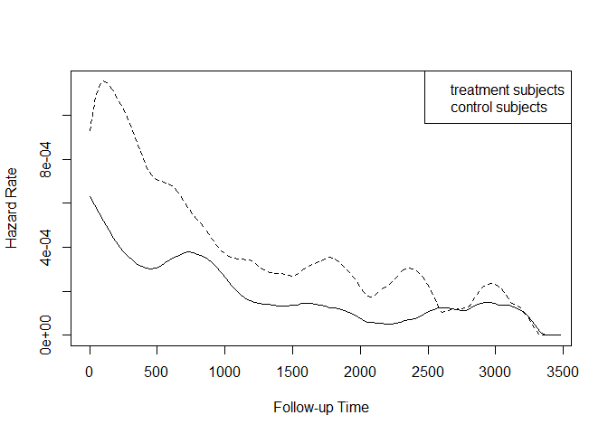

Untitled
================

``` r
# install/load packages ---------------------------------------------------

if (!require('haven')) install.packages('haven') 
```

    ## Loading required package: haven

``` r
if (!require('broom')) install.packages('broom') 
```

    ## Loading required package: broom

``` r
if (!require('epitools')) install.packages('epitools') 
```

    ## Loading required package: epitools

``` r
if (!require('survival')) install.packages('survival')
```

    ## Loading required package: survival

    ## 
    ## Attaching package: 'survival'

    ## The following object is masked from 'package:epitools':
    ## 
    ##     ratetable

``` r
if (!require('MASS')) install.packages('MASS')
```

    ## Loading required package: MASS

``` r
if (!require('car')) install.packages('car')
```

    ## Loading required package: car

    ## Loading required package: carData

``` r
if (!require('geepack')) install.packages('geepack')
```

    ## Loading required package: geepack

``` r
if (!require('muhaz')) install.packages('muhaz')
```

    ## Loading required package: muhaz

``` r
if (!require('survminer')) install.packages('survminer')
```

    ## Loading required package: survminer

    ## Loading required package: ggplot2

    ## Loading required package: ggpubr

``` r
library(haven)
library(broom)
library(epitools)
library(survival)
library(MASS)
library(car)
library(geepack)
library(muhaz)
library(survminer)
```

``` r
# Read in data ------------------------------------------------------------

first <- read_sas("data/hyfirst.sas7bdat")
names(first) <- tolower(names(first))
first$logdays <- log(first$stopday)
```

``` r
all_day <- c(n = sum(!is.na(first$stopday)), mean = mean(first$stopday), sum = sum(first$stopday))
all_event <- c(n = sum(!is.na(first$event)), mean = mean(first$event), sum = sum(first$event))
```

``` r
preg1 <- glm(event ~ 1, family = poisson(), offset = logdays, data = first)
tidy(preg1, conf.int = T)
```

    ## Warning: The `x` argument of `as_tibble.matrix()` must have unique column names if `.name_repair` is omitted as of tibble 2.0.0.
    ## Using compatibility `.name_repair`.
    ## This warning is displayed once every 8 hours.
    ## Call `lifecycle::last_warnings()` to see where this warning was generated.

    ## # A tibble: 1 x 7
    ##   term        estimate std.error statistic p.value conf.low conf.high
    ##   <chr>          <dbl>     <dbl>     <dbl>   <dbl>    <dbl>     <dbl>
    ## 1 (Intercept)    -7.88    0.0499     -158.       0    -7.98     -7.78

``` r
glance(preg1)
```

    ## # A tibble: 1 x 8
    ##   null.deviance df.null logLik   AIC   BIC deviance df.residual  nobs
    ##           <dbl>   <int>  <dbl> <dbl> <dbl>    <dbl>       <int> <int>
    ## 1         1548.     714 -1176. 2354. 2358.    1548.         714   715

``` r
group_day <- tapply(first$stopday, first$intgroup, 
                    function(x)c(n = sum(!is.na(x)), mean = mean(x), sum = sum(x)))
group_event <- tapply(first$event, first$intgroup, function(x)c(n = sum(!is.na(x)), mean = mean(x), sum = sum(x)))

groupevents <- c(all_event[3], group_event$`0`[3], group_event$`1`[3])
grouptime <- c(all_day[3], group_day$`0`[3], group_day$`1`[3])
lambda <- groupevents/grouptime
meansrv <- 1/lambda
neg2lgl <- -2*(groupevents*log(lambda) - lambda*grouptime)

group_lik <- data.frame(intgroup = c(-1, 0, 1), 
                        groupevents,
                        grouptime, 
                        lambda,
                        meansrv,
                        neg2lgl)
group_lik
```

    ##   intgroup groupevents grouptime       lambda  meansrv  neg2lgl
    ## 1       -1         402   1059363 0.0003794733 2635.231 7136.888
    ## 2        0         150    623520 0.0002405697 4156.800 2799.750
    ## 3        1         252    435843 0.0005781899 1729.536 4261.627

``` r
wholen2ll <- group_lik$neg2lgl[is.na(group_lik$intgroup)]
groupn2ll <- sum(group_lik$neg2lgl[!is.na(group_lik$intgroup)])
dif_n2ll <- wholen2ll - groupn2ll
p_value <- pchisq(dif_n2ll, 3, lower.tail = F)
c(wholen2ll = wholen2ll, groupn2ll = groupn2ll, dif_n2ll = dif_n2ll, p_value = p_value)
```

    ## groupn2ll 
    ##  14198.26

``` r
preg2 <- glm(event ~ intgroup, family = poisson(), offset = logdays, data = first)
tidy(preg2, conf.int = T)
```

    ## # A tibble: 2 x 7
    ##   term        estimate std.error statistic  p.value conf.low conf.high
    ##   <chr>          <dbl>     <dbl>     <dbl>    <dbl>    <dbl>     <dbl>
    ## 1 (Intercept)   -8.33     0.0816   -102.   0.         -8.50      -8.18
    ## 2 intgroup       0.877    0.103       8.50 1.85e-17    0.676      1.08

``` r
glance(preg2)
```

    ## # A tibble: 1 x 8
    ##   null.deviance df.null logLik   AIC   BIC deviance df.residual  nobs
    ##           <dbl>   <int>  <dbl> <dbl> <dbl>    <dbl>       <int> <int>
    ## 1         1548.     714 -1138. 2280. 2289.    1472.         713   715

``` r
Anova(preg2)
```

    ## Analysis of Deviance Table (Type II tests)
    ## 
    ## Response: event
    ##          LR Chisq Df Pr(>Chisq)    
    ## intgroup   75.511  1  < 2.2e-16 ***
    ## ---
    ## Signif. codes:  0 '***' 0.001 '**' 0.01 '*' 0.05 '.' 0.1 ' ' 1

``` r
muhaz_0 <- muhaz(first$stopday, first$event, 
                 subset = first$intgroup == 0, 
                 bw.smooth = 200,
                 bw.method = "global",
                 kern = "epanechnikov")
muhaz_1 <- muhaz(first$stopday, first$event, 
                 subset = first$intgroup == 1, 
                 bw.smooth = 200,
                 bw.method = "global",
                 kern = "epanechnikov")
plot(muhaz_1, lty = 2)
lines(muhaz_0)
legend("topright", legend = c("treatment subjects", "control subjects"))
```

<!-- -->
