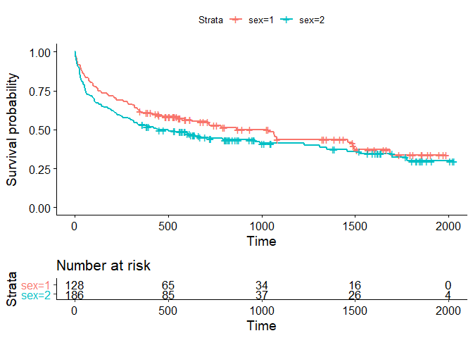

Nonparametric Comparisons of Survival in 2 or More Groups
================

``` r
# install/load packages ---------------------------------------------------

if (!require('haven')) install.packages('haven') 
```

    ## Loading required package: haven

``` r
if (!require('readxl')) install.packages('readxl') 
```

    ## Loading required package: readxl

``` r
if (!require('broom')) install.packages('broom') 
```

    ## Loading required package: broom

``` r
if (!require('epitools')) install.packages('epitools') 
```

    ## Loading required package: epitools

``` r
if (!require('survival')) install.packages('survival')
```

    ## Loading required package: survival

    ## 
    ## Attaching package: 'survival'

    ## The following object is masked from 'package:epitools':
    ## 
    ##     ratetable

``` r
if (!require('MASS')) install.packages('MASS')
```

    ## Loading required package: MASS

``` r
if (!require('car')) install.packages('car')
```

    ## Loading required package: car

    ## Loading required package: carData

``` r
if (!require('geepack')) install.packages('geepack')
```

    ## Loading required package: geepack

``` r
if (!require('muhaz')) install.packages('muhaz')
```

    ## Loading required package: muhaz

``` r
if (!require('survminer')) install.packages('survminer')
```

    ## Loading required package: survminer

    ## Loading required package: ggplot2

    ## Loading required package: ggpubr

``` r
library(readxl)
library(haven)
library(broom)
library(epitools)
library(survival)
library(MASS)
library(car)
library(geepack)
library(muhaz)
library(survminer)
```

``` r
# read in data ------------------------------------------------------------

one <- read_excel("data/AMLChemo.xlsx")
names(one) <- tolower(names(one))

two <- one[which(one$chemo == 0),]
```

``` r
#survival fit object
sfit1 <- survfit(Surv(fupweeks, eventind) ~ 1, data = two)

#liftable
tab <- summary(sfit1, 
        times = c(0, 9, 19, 29, 39, 49, 59), censored = T)
tab
```

    ## Call: survfit(formula = Surv(fupweeks, eventind) ~ 1, data = two)
    ## 
    ##  time n.risk n.event survival std.err lower 95% CI upper 95% CI
    ##     0     12       0    1.000   0.000       1.0000        1.000
    ##     9      8       4    0.667   0.136       0.4468        0.995
    ##    19      6       1    0.583   0.142       0.3616        0.941
    ##    29      4       2    0.389   0.147       0.1854        0.816
    ##    39      2       2    0.194   0.122       0.0569        0.664

``` r
#survival function plot
plot(tab$time, tab$surv)
lines(tab$time, tab$surv)
```

<!-- -->

``` r
#KM estimator
summary(sfit1)
```

    ## Call: survfit(formula = Surv(fupweeks, eventind) ~ 1, data = two)
    ## 
    ##  time n.risk n.event survival std.err lower 95% CI upper 95% CI
    ##     5     12       2   0.8333  0.1076       0.6470        1.000
    ##     8     10       2   0.6667  0.1361       0.4468        0.995
    ##    12      8       1   0.5833  0.1423       0.3616        0.941
    ##    23      6       1   0.4861  0.1481       0.2675        0.883
    ##    27      5       1   0.3889  0.1470       0.1854        0.816
    ##    30      4       1   0.2917  0.1387       0.1148        0.741
    ##    33      3       1   0.1944  0.1219       0.0569        0.664
    ##    43      2       1   0.0972  0.0919       0.0153        0.620
    ##    45      1       1   0.0000     NaN           NA           NA

``` r
# Kaplan-Meier Estimator --------------------------------------------------

#Kaplan Meier table
summary(sfit1)
```

    ## Call: survfit(formula = Surv(fupweeks, eventind) ~ 1, data = two)
    ## 
    ##  time n.risk n.event survival std.err lower 95% CI upper 95% CI
    ##     5     12       2   0.8333  0.1076       0.6470        1.000
    ##     8     10       2   0.6667  0.1361       0.4468        0.995
    ##    12      8       1   0.5833  0.1423       0.3616        0.941
    ##    23      6       1   0.4861  0.1481       0.2675        0.883
    ##    27      5       1   0.3889  0.1470       0.1854        0.816
    ##    30      4       1   0.2917  0.1387       0.1148        0.741
    ##    33      3       1   0.1944  0.1219       0.0569        0.664
    ##    43      2       1   0.0972  0.0919       0.0153        0.620
    ##    45      1       1   0.0000     NaN           NA           NA

``` r
#KM Curve with survival package
plot(sfit1, 
     conf.int = F,
     xlab = "FUpWeeks", 
     ylab = "Survival Probability", 
     main = "Product-Limit Survival Estimate")

#KM Curve with survminer package
ggsurvplot(sfit1, 
           xlab = "FUpWeeks",
           conf.int = F)
```

<!-- --><!-- -->

``` r
#-log survival function
plot(sfit1, 
     conf.int = F,
     cumhaz = T,
     xlab = "FUpWeeks", 
     ylab = "-log(S(t))", 
     main = "Cumalive Hazard Function")
```

<!-- -->

``` r
#c-log-log plot
plot(survfit(Surv(fupweeks, eventind) ~ 1, data = two), 
     conf.int = F,
     xlab = "FUpWeeks", 
     ylab = "Survival Probability", 
     main = "Product-Limit Survival Estimate",
     fun = "cloglog")
```

<!-- -->

``` r
#smoothed hazard function
haz <- muhaz(times = two$fupweeks, delta = two$eventind, 
                 bw.smooth = 25,
                 bw.method = "global",
                 kern = "epanechnikov", max.time = 45)
plot(haz)
```

<!-- -->

``` r
# Nonparametric Comparisons of Survival of 2 Groups --------------------

#survival fits by chemotherapy treatment group
sfit2 <- survfit(Surv(fupweeks, eventind) ~ chemo, data = one)
summary(sfit2)
```

    ## Call: survfit(formula = Surv(fupweeks, eventind) ~ chemo, data = one)
    ## 
    ##                 chemo=0 
    ##  time n.risk n.event survival std.err lower 95% CI upper 95% CI
    ##     5     12       2   0.8333  0.1076       0.6470        1.000
    ##     8     10       2   0.6667  0.1361       0.4468        0.995
    ##    12      8       1   0.5833  0.1423       0.3616        0.941
    ##    23      6       1   0.4861  0.1481       0.2675        0.883
    ##    27      5       1   0.3889  0.1470       0.1854        0.816
    ##    30      4       1   0.2917  0.1387       0.1148        0.741
    ##    33      3       1   0.1944  0.1219       0.0569        0.664
    ##    43      2       1   0.0972  0.0919       0.0153        0.620
    ##    45      1       1   0.0000     NaN           NA           NA
    ## 
    ##                 chemo=1 
    ##  time n.risk n.event survival std.err lower 95% CI upper 95% CI
    ##     9     11       1    0.909  0.0867       0.7541        1.000
    ##    13     10       1    0.818  0.1163       0.6192        1.000
    ##    18      8       1    0.716  0.1397       0.4884        1.000
    ##    23      7       1    0.614  0.1526       0.3769        0.999
    ##    31      5       1    0.491  0.1642       0.2549        0.946
    ##    34      4       1    0.368  0.1627       0.1549        0.875
    ##    48      2       1    0.184  0.1535       0.0359        0.944

``` r
#stratified KM curves
plot(sfit2)
ggsurvplot(sfit2)
```

<!-- --><!-- -->

``` r
#test differences in survival curves: 
#for log rank test set rho = 0
survdiff(Surv(fupweeks, eventind) ~ chemo,
         rho = 0,
         data = one)
```

    ## Call:
    ## survdiff(formula = Surv(fupweeks, eventind) ~ chemo, data = one, 
    ##     rho = 0)
    ## 
    ##          N Observed Expected (O-E)^2/E (O-E)^2/V
    ## chemo=0 12       11     7.31      1.86       3.4
    ## chemo=1 11        7    10.69      1.27       3.4
    ## 
    ##  Chisq= 3.4  on 1 degrees of freedom, p= 0.07

``` r
#for Wilcoxan set rho = 1
survdiff(Surv(fupweeks, eventind) ~ chemo,
         rho = 1,
         data = one)
```

    ## Call:
    ## survdiff(formula = Surv(fupweeks, eventind) ~ chemo, data = one, 
    ##     rho = 1)
    ## 
    ##          N Observed Expected (O-E)^2/E (O-E)^2/V
    ## chemo=0 12     7.18     4.88     1.081      2.78
    ## chemo=1 11     3.85     6.14     0.859      2.78
    ## 
    ##  Chisq= 2.8  on 1 degrees of freedom, p= 0.1

``` r
# Nonparametric Comparisons of Survival of > 2 Groups --------------------

support <- read_sas("data/support.sas7bdat")

#survival curves by disease class
sfit3 <- survfit(Surv(d_time, death) ~ dzclass, data = support)

#stratified survival curves by disease class
ggsurvplot(sfit3, risk.table = T)
```

    ## Warning: Vectorized input to `element_text()` is not officially supported.
    ## Results may be unexpected or may change in future versions of ggplot2.

<!-- -->

``` r
#log rank test
survdiff(Surv(d_time, death) ~ dzclass, 
         rho = 0,
         data = support)
```

    ## Call:
    ## survdiff(formula = Surv(d_time, death) ~ dzclass, data = support, 
    ##     rho = 0)
    ## 
    ##             N Observed Expected (O-E)^2/E (O-E)^2/V
    ## dzclass=1 477      303    312.5     0.288     0.546
    ## dzclass=2 314      179    247.6    19.014    30.531
    ## dzclass=3 149      133     88.0    23.010    26.945
    ## dzclass=4  60       53     19.9    55.129    57.536
    ## 
    ##  Chisq= 99.3  on 3 degrees of freedom, p= <2e-16

``` r
#Wilocoxon test
survdiff(Surv(d_time, death) ~ dzclass, 
         rho = 1,
         data = support)
```

    ## Call:
    ## survdiff(formula = Surv(d_time, death) ~ dzclass, data = support, 
    ##     rho = 1)
    ## 
    ##             N Observed Expected (O-E)^2/E (O-E)^2/V
    ## dzclass=1 477    212.2    207.1     0.124     0.323
    ## dzclass=2 314    107.7    160.8    17.558    38.690
    ## dzclass=3 149     81.6     62.6     5.754     9.017
    ## dzclass=4  60     43.7     14.6    58.051    77.833
    ## 
    ##  Chisq= 108  on 3 degrees of freedom, p= <2e-16

``` r
#cumulative hazards plot
ggsurvplot(sfit3, fun = "cumhaz")
```

<!-- -->

``` r
#clog log plots
ggsurvplot(sfit3, fun = "cloglog")
```

<!-- -->

``` r
#survival curves by sex
sfit4 <- survfit(Surv(d_time, death) ~ sex, 
                 data = support,
                 subset = dzclass == 2)

ggsurvplot(sfit4, risk.table = T)
```

    ## Warning: Vectorized input to `element_text()` is not officially supported.
    ## Results may be unexpected or may change in future versions of ggplot2.

<!-- -->

``` r
#log rank test
survdiff(Surv(d_time, death) ~ sex, 
         rho = 0,
         data = support)
```

    ## Call:
    ## survdiff(formula = Surv(d_time, death) ~ sex, data = support, 
    ##     rho = 0)
    ## 
    ##         N Observed Expected (O-E)^2/E (O-E)^2/V
    ## sex=1 438      281      300      1.25      2.28
    ## sex=2 562      387      368      1.02      2.28
    ## 
    ##  Chisq= 2.3  on 1 degrees of freedom, p= 0.1

``` r
#wilcoxon test
survdiff(Surv(d_time, death) ~ sex, 
         rho = 1,
         data = support)
```

    ## Call:
    ## survdiff(formula = Surv(d_time, death) ~ sex, data = support, 
    ##     rho = 1)
    ## 
    ##         N Observed Expected (O-E)^2/E (O-E)^2/V
    ## sex=1 438      187      199     0.782      1.97
    ## sex=2 562      258      246     0.633      1.97
    ## 
    ##  Chisq= 2  on 1 degrees of freedom, p= 0.2

``` r
#cumulative hazards plot by sex
ggsurvplot(sfit3, fun = "cumhaz")
```

<!-- -->

``` r
#clog log plot by sex
ggsurvplot(sfit3, fun = "cloglog")
```

<!-- -->
