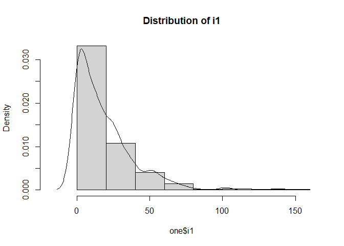
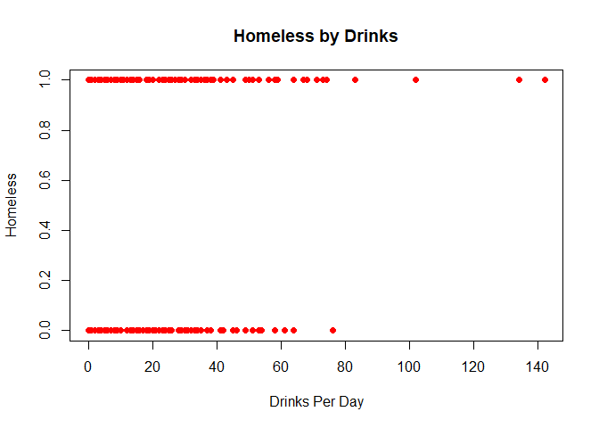
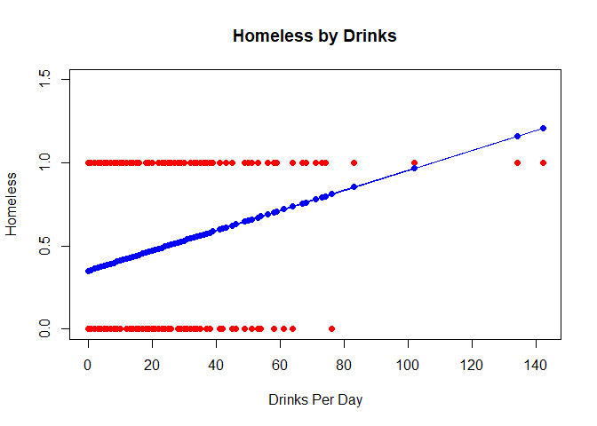
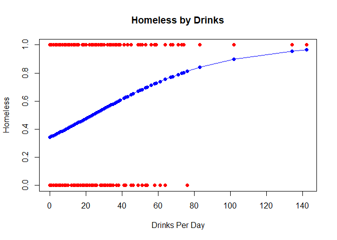
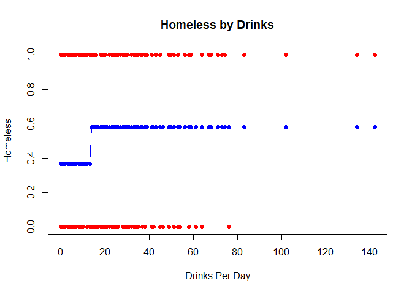
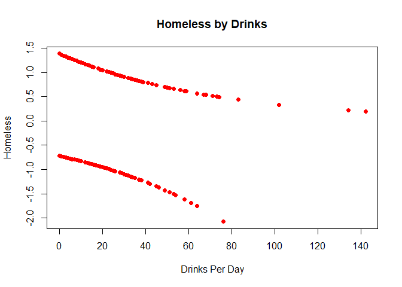
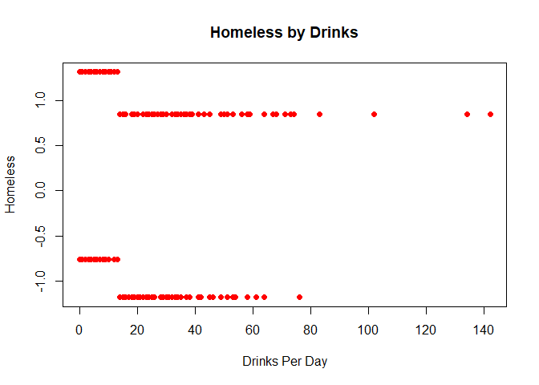

Logistic regression with a single predictor
================

## Prerequisites

``` r
if (!require('readxl')) install.packages('readxl') 
```

    ## Loading required package: readxl

``` r
if (!require('broom')) install.packages('broom') 
```

    ## Loading required package: broom

``` r
if (!require('epitools')) install.packages('epitools') 
```

    ## Loading required package: epitools

``` r
library(readxl)
library(broom)
library(epitools)
```

## Example: HELP data

``` r
zero <- read_excel("data/HELPJsat.xlsx")

one <- zero

#create binary drinks variables
one$drinks <- ifelse(one$i1 > 13, 1, 
                     ifelse(one$i1 <= 13, 0, NA))
```

``` r
table(one$homeless)
```

    ## 
    ##   0   1 
    ## 250 215

``` r
#histogram of drinks per day
hist(one$i1, 
     freq = F, 
     xlim = c(-18, 162), 
     main = "Distribution of i1")
lines(density(one$i1))
```

<!-- -->

``` r
#scatter plot of homeless against drinks per day
plot(one$i1, one$homeless, 
     col = "red",
     pch = 19,
     xlab = "Drinks Per Day",
     ylab = "Homeless",
     main = "Homeless by Drinks")
```

<!-- -->

``` r
#2 sample t-test of mean drinks per day by homeless with unequal and equal variance
t.test(one$i1 ~ one$homeless, var.equal = F)
```

    ## 
    ##  Welch Two Sample t-test
    ## 
    ## data:  one$i1 by one$homeless
    ## t = -5.2771, df = 362.14, p-value = 2.266e-07
    ## alternative hypothesis: true difference in means is not equal to 0
    ## 95 percent confidence interval:
    ##  -13.583165  -6.207905
    ## sample estimates:
    ## mean in group 0 mean in group 1 
    ##        13.84400        23.73953

``` r
t.test(one$i1 ~ one$homeless, var.equal = T)
```

    ## 
    ##  Two Sample t-test
    ## 
    ## data:  one$i1 by one$homeless
    ## t = -5.4341, df = 463, p-value = 8.92e-08
    ## alternative hypothesis: true difference in means is not equal to 0
    ## 95 percent confidence interval:
    ##  -13.474001  -6.317069
    ## sample estimates:
    ## mean in group 0 mean in group 1 
    ##        13.84400        23.73953

``` r
#linear regression model
linar <- lm(homeless ~ i1, data = one)
#nicely print out lm results
tidy(linar)
```

    ## # A tibble: 2 x 5
    ##   term        estimate std.error statistic  p.value
    ##   <chr>          <dbl>     <dbl>     <dbl>    <dbl>
    ## 1 (Intercept)  0.351     0.0304      11.5  3.45e-27
    ## 2 i1           0.00606   0.00111      5.43 8.92e- 8

``` r
#scatter plot of homeless against drinks per day with overlayed fitted values
plot(one$i1, one$homeless, 
     col = "red",
     pch = 19,
     xlab = "Drinks Per Day",
     ylab = "Homeless",
     main = "Homeless by Drinks",
     ylim = c(0, 1.5))
points(one$i1, linar$fitted.values, pch = 19, col = "blue")
lines(one$i1, linar$fitted.values, col = "blue")
```

<!-- -->

``` r
# 2 by 2 table of homeless by drinks
table(one$homeless, one$drinks,dnn = c("homeless", "drinks"))
```

    ##         drinks
    ## homeless   0   1
    ##        0 164  86
    ##        1  95 120

``` r
#Chi squared test
chisq.test(one$homeless, one$drinks, correct = F)
```

    ## 
    ##  Pearson's Chi-squared test
    ## 
    ## data:  one$homeless and one$drinks
    ## X-squared = 21.481, df = 1, p-value = 3.573e-06

``` r
#from epitools package - prints output similar to proc freq
oddsratio(one$drinks, one$homeless, method = "wald")
```

    ## $data
    ##          Outcome
    ## Predictor   0   1 Total
    ##     0     164  95   259
    ##     1      86 120   206
    ##     Total 250 215   465
    ## 
    ## $measure
    ##          odds ratio with 95% C.I.
    ## Predictor estimate    lower    upper
    ##         0 1.000000       NA       NA
    ##         1 2.408813 1.655738 3.504406
    ## 
    ## $p.value
    ##          two-sided
    ## Predictor   midp.exact fisher.exact   chi.square
    ##         0           NA           NA           NA
    ##         1 3.699673e-06 4.237526e-06 3.573182e-06
    ## 
    ## $correction
    ## [1] FALSE
    ## 
    ## attr(,"method")
    ## [1] "Unconditional MLE & normal approximation (Wald) CI"

``` r
# logistic regression with 1 cont predictor -------------------------------
m1_logistic <- glm(homeless ~ i1, data = one, family = binomial())

tidy(m1_logistic)
```

    ## # A tibble: 2 x 5
    ##   term        estimate std.error statistic     p.value
    ##   <chr>          <dbl>     <dbl>     <dbl>       <dbl>
    ## 1 (Intercept)  -0.653    0.136       -4.81 0.00000153 
    ## 2 i1            0.0278   0.00557      5.00 0.000000576

``` r
tidy(m1_logistic, exp = T, conf.int = T)
```

    ## # A tibble: 2 x 7
    ##   term        estimate std.error statistic     p.value conf.low conf.high
    ##   <chr>          <dbl>     <dbl>     <dbl>       <dbl>    <dbl>     <dbl>
    ## 1 (Intercept)    0.520   0.136       -4.81 0.00000153     0.397     0.677
    ## 2 i1             1.03    0.00557      5.00 0.000000576    1.02      1.04

``` r
plot(one$i1, one$homeless, 
     col = "red",
     pch = 19,
     xlab = "Drinks Per Day",
     ylab = "Homeless",
     main = "Homeless by Drinks")
points(one$i1, m1_logistic$fitted.values, pch = 19, col = "blue")
lines(one$i1[order(one$i1)], m1_logistic$fitted.values[order(one$i1)], col = "blue")
```

<!-- -->

``` r
# logistic regression with 1 binary predictor -----------------------------
m2_logistic <- glm(homeless ~ drinks, data = one, family = binomial())
tidy(m2_logistic)
```

    ## # A tibble: 2 x 5
    ##   term        estimate std.error statistic    p.value
    ##   <chr>          <dbl>     <dbl>     <dbl>      <dbl>
    ## 1 (Intercept)   -0.546     0.129     -4.23 0.0000229 
    ## 2 drinks         0.879     0.191      4.60 0.00000430

``` r
#from broom package nicely print out odds ratio and 95% CI
tidy(m2_logistic, exp = T, conf.int = T)
```

    ## # A tibble: 2 x 7
    ##   term        estimate std.error statistic    p.value conf.low conf.high
    ##   <chr>          <dbl>     <dbl>     <dbl>      <dbl>    <dbl>     <dbl>
    ## 1 (Intercept)    0.579     0.129     -4.23 0.0000229     0.448     0.744
    ## 2 drinks         2.41      0.191      4.60 0.00000430    1.66      3.51

``` r
#from broom package nicely print out model fit statistics
glance(m2_logistic)
```

    ## # A tibble: 1 x 8
    ##   null.deviance df.null logLik   AIC   BIC deviance df.residual  nobs
    ##           <dbl>   <int>  <dbl> <dbl> <dbl>    <dbl>       <int> <int>
    ## 1          642.     464  -310.  624.  633.     620.         463   465

``` r
plot(one$i1, one$homeless, 
     col = "red",
     pch = 19,
     xlab = "Drinks Per Day",
     ylab = "Homeless",
     main = "Homeless by Drinks")
points(one$i1, m2_logistic$fitted.values, pch = 19, col = "blue")
lines(one$i1[order(one$i1)], m2_logistic$fitted.values[order(one$i1)], col = "blue")
```

<!-- -->

``` r
# Pearson Residual Plots ---------------------------------------------------------------

plot(one$i1, residuals(m1_logistic, "pearson"), 
     col = "red",
     pch = 19,
     xlab = "Drinks Per Day",
     ylab = "Homeless",
     main = "Homeless by Drinks")
```

<!-- -->

``` r
plot(one$i1, residuals(m2_logistic, "pearson"), 
     col = "red",
     pch = 19,
     xlab = "Drinks Per Day",
     ylab = "Homeless",
     main = "Homeless by Drinks")
```

<!-- -->
