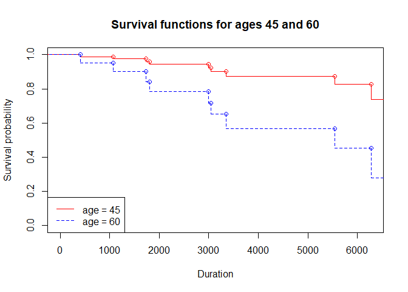
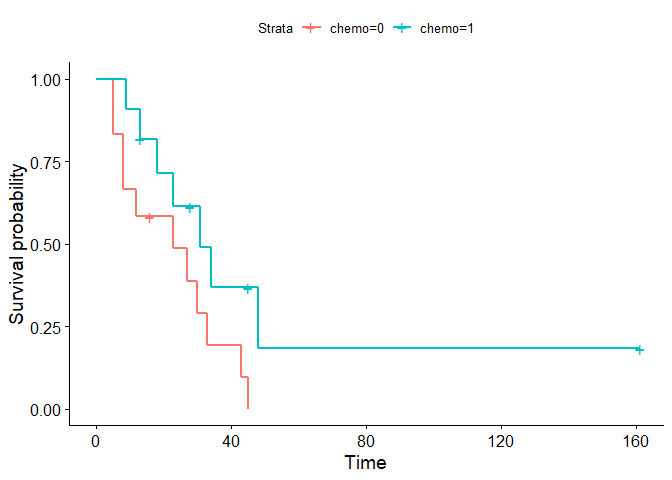
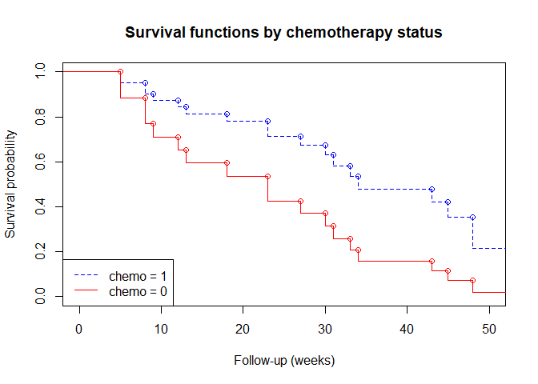
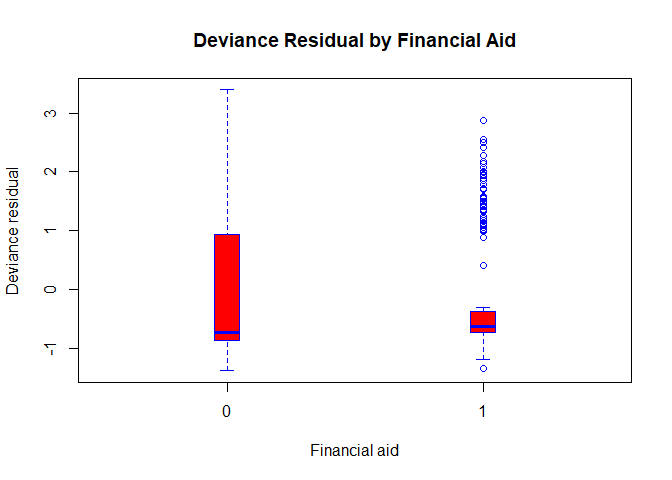
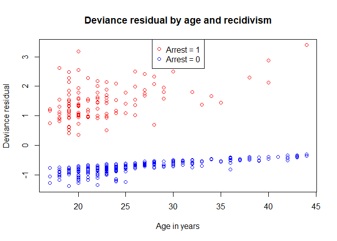

Lecture 10: Proportional Hazards in Semi-parametric (Cox) Regression
Models
================

``` r
# install/load packages ---------------------------------------------------

if (!require('haven')) install.packages('haven') 
```

    ## Loading required package: haven

``` r
if (!require('readxl')) install.packages('readxl') 
```

    ## Loading required package: readxl

``` r
if (!require('broom')) install.packages('broom') 
```

    ## Loading required package: broom

``` r
if (!require('epitools')) install.packages('epitools') 
```

    ## Loading required package: epitools

``` r
if (!require('survival')) install.packages('survival')
```

    ## Loading required package: survival

    ## 
    ## Attaching package: 'survival'

    ## The following object is masked from 'package:epitools':
    ## 
    ##     ratetable

``` r
if (!require('MASS')) install.packages('MASS')
```

    ## Loading required package: MASS

``` r
if (!require('car')) install.packages('car')
```

    ## Loading required package: car

    ## Loading required package: carData

``` r
if (!require('geepack')) install.packages('geepack')
```

    ## Loading required package: geepack

``` r
if (!require('muhaz')) install.packages('muhaz')
```

    ## Loading required package: muhaz

``` r
if (!require('survminer')) install.packages('survminer')
```

    ## Loading required package: survminer

    ## Loading required package: ggplot2

    ## Loading required package: ggpubr

``` r
if (!require('flexsurv')) install.packages('flexsurv')
```

    ## Loading required package: flexsurv

``` r
library(readxl)
library(haven)
library(broom)
library(epitools)
library(survival)
library(MASS)
library(car)
library(geepack)
library(muhaz)
library(survminer)
library(flexsurv)
```

``` r
# read in data ------------------------------------------------------------

brscan <- read.table("data/brscan.txt",
                     col.names = c("id", "age", "durat", "status"))
```

``` r
# fit cox models  -------------------------------------------------------------

cph1 <- coxph(Surv(durat, status) ~ age,
              data = brscan)
survfit(cph1)$surv
```

    ##  [1] 0.9523035 0.9523035 0.9001867 0.8407369 0.7813196 0.7137626 0.6499457
    ##  [8] 0.5659964 0.4505808 0.2756702 0.2756702 0.2756702 0.2756702

``` r
brscan$survprb1 <- predict(cph1, newdata= brscan, type = "survival")
brscan <- brscan[order(brscan$age), ]

survprb_age45 <- data.frame(age = 45, 
                            durat = c(0, brscan$durat[brscan$status == 1]),
                            surfun = c(1, predict(cph1, 
                                             newdata = data.frame(brscan[, -2], age = 45), 
                                             type = "survival")[brscan$status == 1]))
survprb_age45 <- survprb_age45[order(survprb_age45$durat),]

survprb_age60 <- data.frame(age = 60, 
                            durat = c(0, brscan$durat[brscan$status == 1]),
                            surfun = c(1, predict(cph1, 
                                                  newdata = data.frame(brscan[, -2], age = 60), 
                                                  type = "survival")[brscan$status == 1]))
survprb_age60 <- survprb_age60[order(survprb_age60$durat),]
survprb <- cbind(survprb_age45, survprb_age60)

plot(stepfun(survprb_age45$durat[-1], survprb_age45$surfun, right = T), 
     col = "red", ylim = c(0,1), xlim = c(0, 6277),
     main = "Survival functions for ages 45 and 60",
     xlab = "Duration",
     ylab = "Survival probability")
lines(stepfun(survprb_age60$durat[-1], survprb_age60$surfun, right = T), 
      col = "blue", lty = 2)
legend("bottomleft", legend = c("age = 45", "age = 60"), col = c("red", "blue"), lty = 1:2)
```

<!-- -->

``` r
# read in data ------------------------------------------------------------

chemo <- read_excel("data/AMLChemo.xlsx")
names(chemo) <- tolower(names(chemo))
```

``` r
ggsurvplot(survfit(Surv(fupweeks, eventind) ~ chemo, data = chemo))
```

<!-- -->

``` r
survdiff(Surv(fupweeks, eventind) ~ chemo, data = chemo)
```

    ## Call:
    ## survdiff(formula = Surv(fupweeks, eventind) ~ chemo, data = chemo)
    ## 
    ##          N Observed Expected (O-E)^2/E (O-E)^2/V
    ## chemo=0 12       11     7.31      1.86       3.4
    ## chemo=1 11        7    10.69      1.27       3.4
    ## 
    ##  Chisq= 3.4  on 1 degrees of freedom, p= 0.07

``` r
# PHreg models ------------------------------------------------------------

cph2 <- coxph(Surv(fupweeks, eventind) ~ chemo, 
              ties = "exact",
              data = chemo)

summary(cph2)
```

    ## Call:
    ## coxph(formula = Surv(fupweeks, eventind) ~ chemo, data = chemo, 
    ##     ties = "exact")
    ## 
    ##   n= 23, number of events= 18 
    ## 
    ##          coef exp(coef) se(coef)      z Pr(>|z|)  
    ## chemo -0.9218    0.3978   0.5162 -1.785   0.0742 .
    ## ---
    ## Signif. codes:  0 '***' 0.001 '**' 0.01 '*' 0.05 '.' 0.1 ' ' 1
    ## 
    ##       exp(coef) exp(-coef) lower .95 upper .95
    ## chemo    0.3978      2.514    0.1446     1.094
    ## 
    ## Concordance= 0.619  (se = 0.063 )
    ## Likelihood ratio test= 3.36  on 1 df,   p=0.07
    ## Wald test            = 3.19  on 1 df,   p=0.07
    ## Score (logrank) test = 3.4  on 1 df,   p=0.07

``` r
tidy(cph2)
```

    ## # A tibble: 1 x 5
    ##   term  estimate std.error statistic p.value
    ##   <chr>    <dbl>     <dbl>     <dbl>   <dbl>
    ## 1 chemo   -0.922     0.516     -1.79  0.0742

``` r
survprb_chemo0 <- data.frame(chemo = 0, 
                            fupweeks = c(0, chemo$fupweeks[chemo$eventind == 1]),
                            surfun = c(1, predict(cph2, 
                                                  newdata = data.frame(chemo[, -2], chemo = 0), 
                                                  type = "survival")[chemo$eventind == 1]))
survprb_chemo0 <- survprb_chemo0[order(survprb_chemo0$fupweeks),]

survprb_chemo1 <- data.frame(chemo = 1, 
                             fupweeks = c(0, chemo$fupweeks[chemo$eventind == 1]),
                             surfun = c(1, predict(cph2, 
                                                   newdata = data.frame(chemo[, -2], chemo = 1), 
                                                   type = "survival")[chemo$eventind == 1]))
survprb_chemo1 <- survprb_chemo1[order(survprb_chemo1$fupweeks),]

plot(stepfun(unique(survprb_chemo1$fupweeks)[-1], unique(survprb_chemo1$surfun), right = T), 
     col = "blue", 
     ylim = c(0,1),
     xlim = c(0, 50),
     main = "Survival functions by chemotherapy status",
     xlab = "Follow-up (weeks)",
     ylab = "Survival probability", 
     lty = 2)
lines(stepfun(unique(survprb_chemo0$fupweeks)[-1], unique(survprb_chemo0$surfun), right = T), 
      col = "red")
legend("bottomleft", legend = c("chemo = 1", "chemo = 0"), col = c("blue", "red"), lty = 2:1)
```

<!-- -->

``` r
# read in data ------------------------------------------------------------

recid <- read_sas("data/recidiv_cls10.sas7bdat")
names(recid) <- tolower(names(recid))
```

``` r
# cox models --------------------------------------------------------------

cph3 <- coxph(Surv(week, arrest) ~ fin + age + prio, 
              ties = "exact",
              data = recid,
              id = id)

summary(cph3)
```

    ## Call:
    ## coxph(formula = Surv(week, arrest) ~ fin + age + prio, data = recid, 
    ##     ties = "exact", id = id)
    ## 
    ##   n= 432, number of events= 114 
    ## 
    ##          coef exp(coef) se(coef)      z Pr(>|z|)    
    ## fin  -0.34868   0.70562  0.19085 -1.827 0.067703 .  
    ## age  -0.06725   0.93496  0.02089 -3.219 0.001286 ** 
    ## prio  0.09730   1.10220  0.02740  3.552 0.000383 ***
    ## ---
    ## Signif. codes:  0 '***' 0.001 '**' 0.01 '*' 0.05 '.' 0.1 ' ' 1
    ## 
    ##      exp(coef) exp(-coef) lower .95 upper .95
    ## fin     0.7056     1.4172    0.4854     1.026
    ## age     0.9350     1.0696    0.8975     0.974
    ## prio    1.1022     0.9073    1.0446     1.163
    ## 
    ## Concordance= 0.63  (se = 0.027 )
    ## Likelihood ratio test= 29.07  on 3 df,   p=2e-06
    ## Wald test            = 27.91  on 3 df,   p=4e-06
    ## Score (logrank) test = 29.04  on 3 df,   p=2e-06

``` r
tidy(cph3)
```

    ## # A tibble: 3 x 5
    ##   term  estimate std.error statistic  p.value
    ##   <chr>    <dbl>     <dbl>     <dbl>    <dbl>
    ## 1 fin    -0.349     0.191      -1.83 0.0677  
    ## 2 age    -0.0672    0.0209     -3.22 0.00129 
    ## 3 prio    0.0973    0.0274      3.55 0.000383

``` r
recid$dresid <- residuals(cph3, type = "deviance")

boxplot(dresid ~ fin, boxwex = 0.1, data = recid,
        main = "Deviance Residual by Financial Aid",
        ylab = "Deviance residual",
        xlab = "Financial aid", 
        col = "red",
        border = "blue")
```

<!-- -->

``` r
palette(c("blue", "red"))
plot(recid$age, recid$dresid, 
     col = factor(recid$arrest),
     main = "Deviance residual by age and recidivism",
     xlab = "Age in years",
     ylab = "Deviance residual")
legend("top", legend = c("Arrest = 1", "Arrest = 0"), col = c("red", "blue"), pch = 1)
```

<!-- -->

``` r
palette(c("blue", "red"))
plot(recid$prio, recid$dresid, 
     col = factor(recid$arrest),
     main = "Deviance residual by number of prior arrests and recidivism",
     xlab = "Number of prior arrests",
     ylab = "Deviance residual")
legend("topright", legend = c("Arrest = 1", "Arrest = 0"), col = c("red", "blue"), pch = 1)
```

<!-- -->
